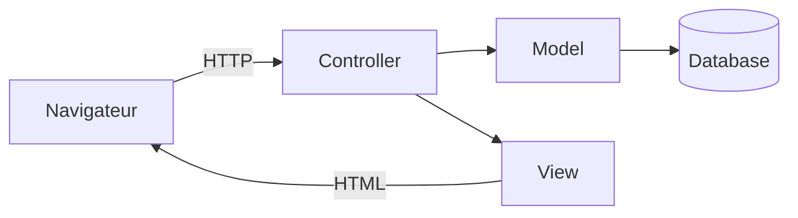
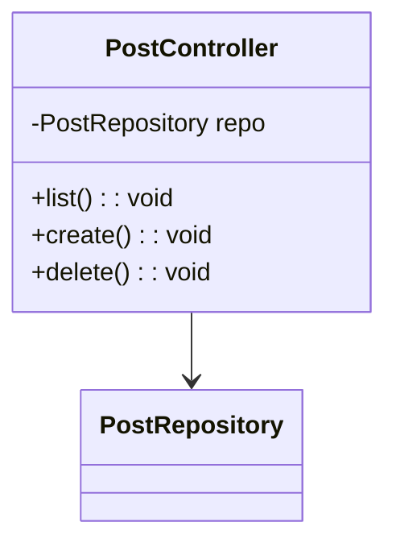

# Cours MVC en PHP - Du procédural au MVC POO (mini blog)

## Intention pédagogique

Ce cours a un but très concret : **préparer l’entrée dans Symfony** en comprenant d’abord une architecture MVC "à la main".

Symfony n’est pas un mystère. Il automatise et formalise des idées simples :

* une requête HTTP arrive
* une route choisit un contrôleur
* le contrôleur orchestre la logique
* la logique lit ou écrit des données via un modèle
* une vue fabrique la réponse HTML

Avant d’utiliser un framework, ce cours te fait construire ces briques progressivement, à partir d’un mini blog.

---

## Prérequis techniques

* PHP 8.1+ (idéalement 8.2 ou 8.3)
* Un serveur local (Apache, Nginx, ou `symfony serve` si tu l’as déjà)
* Une base MariaDB/MySQL (ou SQLite si tu préfères)

Le code de départ fourni est un mini blog procédural (liste, création, suppression) avec PDO.

---

## Plan du cours

1. Comprendre le problème du procédural en web
2. Définir MVC (qui fait quoi)
3. Étape A - Version procédurale monopage (volontairement imparfaite)
4. Étape B - Séparer en pages (procédural multi fichiers)
5. Étape C - Introduire un Front Controller (une seule porte d’entrée)
6. Étape D - Introduire des vues (templates) et un rendu propre
7. Étape E - Construire le Model (Repository + entités simples)
8. Étape F - Construire les Controllers en POO
9. Étape G - Ajouter une couche Service (logique métier)
10. Sécurité minimale et erreurs fréquentes
11. Pont vers Symfony (sans coder Symfony)

---

## 1 Le problème du procédural en web

### 1.1 Le symptôme

Dans un mini projet, on finit souvent avec :

* du SQL dans la page
* de la validation dans la page
* du HTML partout
* des redirections dans tous les coins

Même si le projet marche, il devient fragile.

### 1.2 Le vrai problème

Le problème n’est pas la syntaxe, mais l’absence de séparation des responsabilités.

Quand tout est dans le même fichier, on ne sait plus :

* où modifier l’affichage
* où modifier une règle métier
* où modifier une requête SQL

Une petite modification entraîne des effets de bord.

---

## 2 MVC : définition claire et utilisable

MVC signifie Model View Controller.

* **Model** : données et accès aux données (ex: PDO, SQL, Repository)
* **View** : rendu (HTML), sans SQL
* **Controller** : orchestration (reçoit la requête, appelle le modèle, choisit la vue)

### Schéma MVC



Important : MVC n’est pas une règle absolue, c’est une façon simple de rendre le code compréhensible.

---

## 3 Étape A - Version procédurale monopage

Cette étape sert à montrer pourquoi on va changer.

### 3.1 Objectif

* Une seule page `index.php`
* Elle affiche la liste
* Elle gère aussi la création et la suppression selon un paramètre `action`

### 3.2 Exemple de structure (procédurale)

```php
<?php
declare(strict_types=1);
require __DIR__ . '/db.php';

$action = $_GET['action'] ?? 'list';

if ($action === 'create' && $_SERVER['REQUEST_METHOD'] === 'POST') {
    // validation
    // SQL INSERT
    // redirect
}

if ($action === 'delete') {
    // SQL DELETE
    // redirect
}

// SQL SELECT
// HTML
```

### 3.3 Ce que l’on observe

Ce type de page mélange :

* le contrôle (choix de l’action)
* les requêtes SQL
* la validation
* la génération HTML

Cela fonctionne, mais c’est difficile à maintenir.

---

## 4 Étape B - Procédural multi fichiers

C’est souvent la première amélioration naturelle.

* `index.php` liste
* `create.php` gère la création
* `delete.php` gère la suppression
* `db.php` gère la connexion

C’est mieux, mais on reste dans un modèle "page = action".

Limite : la duplication commence.

---

## 5 Étape C - Front Controller (un seul point d’entrée)

### 5.1 Pourquoi

Dans un framework, tu n’as pas une page par action. Tu as un point d’entrée unique.

Cela permet :

* un routage centralisé
* une gestion cohérente des erreurs
* des middlewares (auth, CSRF, etc.)

### 5.2 Mise en place

On crée :

* `public/index.php` comme point d’entrée
* un mini routeur

Arborescence proposée :

```bash
mini-blog-mvc/
  public/
    index.php
  src/
  templates/
  config/
  vendor/
```

Le `public/` est la seule racine web (bonne pratique).

### 5.3 Routeur minimal

```php
<?php
declare(strict_types=1);

$path = parse_url($_SERVER['REQUEST_URI'], PHP_URL_PATH) ?? '/';

if ($path === '/' || $path === '/posts') {
    // appeler controller list
} elseif ($path === '/posts/create') {
    // appeler controller create
} elseif ($path === '/posts/delete') {
    // appeler controller delete
} else {
    http_response_code(404);
    echo '404';
}
```

On n’est pas encore en POO. On prépare le terrain.

---

## 6 Étape D - Les vues (templates)

### 6.1 Pourquoi

Une vue est un fichier responsable de l’affichage. Le contrôleur lui donne des données.

Le contrôleur ne doit pas écrire du HTML en dur.

### 6.2 Première convention

* Un layout général `templates/layout.php`
* Des vues par page `templates/post/list.php`, etc.

### 6.3 Un mini moteur de rendu

On écrit une fonction `render()` pour inclure une vue avec des variables.

```php
<?php
declare(strict_types=1);

function render(string $template, array $params = []): void
{
    extract($params);
    $templatePath = __DIR__ . '/../templates/' . $template;

    require __DIR__ . '/../templates/layout.php';
}
```

Dans `layout.php` :

```php
<!doctype html>
<html lang="fr">
<head>
  <meta charset="utf-8">
  <title><?= htmlspecialchars($title ?? 'Mini Blog', ENT_QUOTES) ?></title>
</head>
<body>
  <main>
    <?php require $templatePath; ?>
  </main>
</body>
</html>
```

L’idée est simple : la vue spécialisée s’insère dans le layout.

---

## 7 Étape E - Le Model : Repository + entités simples

### 7.1 Pourquoi

En procédural, on écrit du SQL dans chaque page.

En MVC, on veut que l’accès aux données soit centralisé.

On introduit un **Repository** : un objet responsable des requêtes SQL.

### 7.2 Schéma

```mermaid
classDiagram
  class PostRepository {
    -PDO pdo
    +findAll(): array
    +create(title, content, author): void
    +delete(id): void
  }

  PostRepository --> "PDO" : utilise
```

### 7.3 Exemple de Repository

```php
<?php
declare(strict_types=1);

final class PostRepository
{
    public function __construct(private PDO $pdo) {}

    public function findAll(): array
    {
        $stmt = $this->pdo->query(
            'SELECT post_id, post_title, post_author, post_created_at FROM post ORDER BY post_created_at DESC'
        );
        return $stmt->fetchAll();
    }

    public function create(string $title, string $content, string $author): void
    {
        $stmt = $this->pdo->prepare(
            'INSERT INTO post (post_title, post_content, post_author, post_created_at) VALUES (:t, :c, :a, NOW())'
        );
        $stmt->execute([':t' => $title, ':c' => $content, ':a' => $author]);
    }

    public function delete(int $id): void
    {
        $stmt = $this->pdo->prepare('DELETE FROM post WHERE post_id = :id');
        $stmt->execute([':id' => $id]);
    }
}
```

Ce repository devient l’unique endroit où l’on touche au SQL pour les posts.

---

## 8 Étape F - Controllers en POO

### 8.1 Pourquoi

Le contrôleur devient une classe. Elle reçoit ses dépendances (repository, service, etc.).

Cela prépare directement à la philosophie Symfony.

### 8.2 Schéma



### 8.3 Exemple de Controller

```php
<?php
declare(strict_types=1);

final class PostController
{
    public function __construct(private PostRepository $repo) {}

    public function list(): void
    {
        $posts = $this->repo->findAll();
        render('post/list.php', [
            'title' => 'Liste des articles',
            'posts' => $posts,
        ]);
    }

    public function create(): void
    {
        $errors = [];
        $title = '';
        $content = '';
        $author = '';

        if ($_SERVER['REQUEST_METHOD'] === 'POST') {
            $title = trim((string)($_POST['title'] ?? ''));
            $content = trim((string)($_POST['content'] ?? ''));
            $author = trim((string)($_POST['author'] ?? ''));

            if ($title === '') $errors[] = 'Titre obligatoire';
            if ($content === '') $errors[] = 'Contenu obligatoire';
            if ($author === '') $errors[] = 'Auteur obligatoire';

            if (!$errors) {
                $this->repo->create($title, $content, $author);
                redirect('/posts');
            }
        }

        render('post/create.php', [
            'title' => 'Créer un article',
            'errors' => $errors,
            'form' => compact('title','content','author'),
        ]);
    }

    public function delete(): void
    {
        $id = filter_input(INPUT_GET, 'id', FILTER_VALIDATE_INT);
        if (!$id || $id <= 0) {
            redirect('/posts');
        }

        $this->repo->delete((int)$id);
        redirect('/posts');
    }
}
```

Tu vois la différence : le contrôleur orchestre, mais ne fait plus de SQL.

---

## 9 Étape G - Service : logique métier

### 9.1 Pourquoi

Dans l’exemple ci-dessus, la validation et les règles métier sont encore dans le contrôleur.

On va créer un **service** qui porte les règles.

Objectif : le contrôleur devient très simple.

### 9.2 Exemple

```php
final class PostService
{
    public function __construct(private PostRepository $repo) {}

    public function createFromArray(array $input): array
    {
        $title = trim((string)($input['title'] ?? ''));
        $content = trim((string)($input['content'] ?? ''));
        $author = trim((string)($input['author'] ?? ''));

        $errors = [];
        if ($title === '') $errors[] = 'Titre obligatoire';
        if ($content === '') $errors[] = 'Contenu obligatoire';
        if ($author === '') $errors[] = 'Auteur obligatoire';

        if (!$errors) {
            $this->repo->create($title, $content, $author);
        }

        return [$errors, compact('title','content','author')];
    }
}
```

Le contrôleur appelle le service, puis choisit la vue.

---

## 10 Sécurité minimale et erreurs fréquentes

### 10.1 Échapper le HTML

Dans les vues, toujours :

* `htmlspecialchars()` pour du texte
* `nl2br(htmlspecialchars())` pour un contenu multi ligne

### 10.2 CSRF

La suppression via un lien GET est pédagogique, mais en vrai on passe par POST + token CSRF.

### 10.3 Validation

Ne pas se contenter de `trim()` : en vrai on valide aussi longueur, format, etc.

### 10.4 Erreurs fréquentes

* mettre du SQL dans les vues
* faire du HTML dans le repository
* laisser le contrôleur devenir énorme
* dupliquer la connexion PDO partout

---

## 11 Pont vers Symfony

Ce que tu as construit correspond presque directement à Symfony :

* `public/index.php` - Front Controller
* routeur - Routing Symfony
* controller - Controller Symfony
* repository - Repository (Doctrine ou PDO)
* render() - Twig
* service - Service + injection de dépendances

Symfony ne fait pas autre chose. Il le fait de manière robuste, standardisée et outillée.

---

## Exercices proposés (progressifs)

1. Ajouter une page "voir un article" (route `/posts/show?id=...`)
2. Ajouter une mise à jour (edit) avec validation
3. Passer la suppression en POST + CSRF token
4. Extraire la gestion PDO dans une classe `Database`
5. Introduire un autoload Composer et des namespaces

---

## Conclusion

Si tu comprends et sais expliquer cette progression, alors Symfony devient simple :

* Symfony va remplacer ton routeur par un routeur puissant
* Symfony va remplacer ton `render()` par Twig
* Symfony va gérer les services et les dépendances
* Symfony va structurer encore mieux les dossiers

Mais la logique, c’est exactement ce que tu viens d’apprendre.
