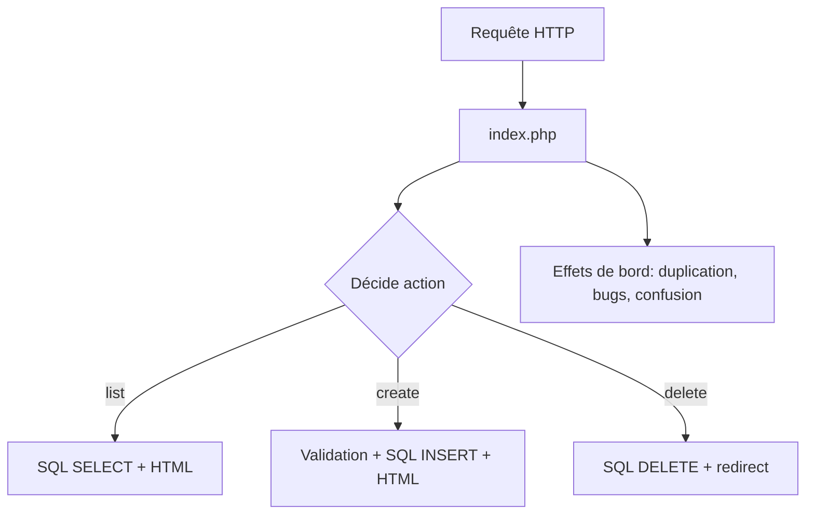
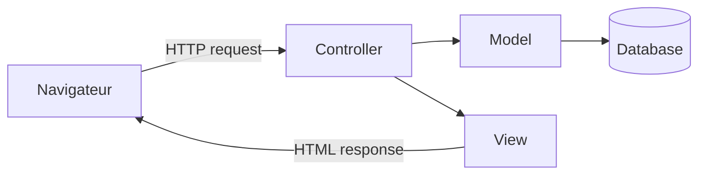
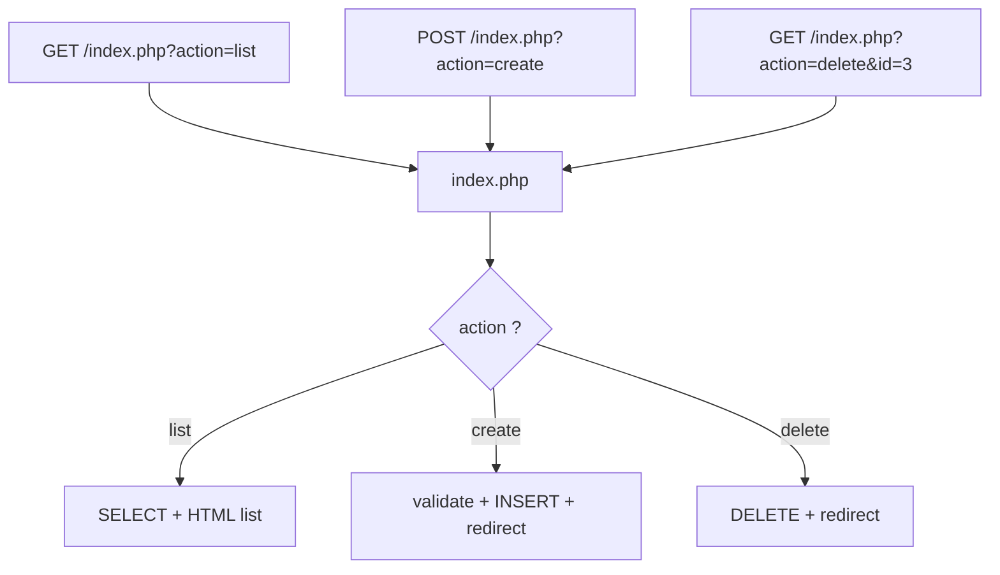
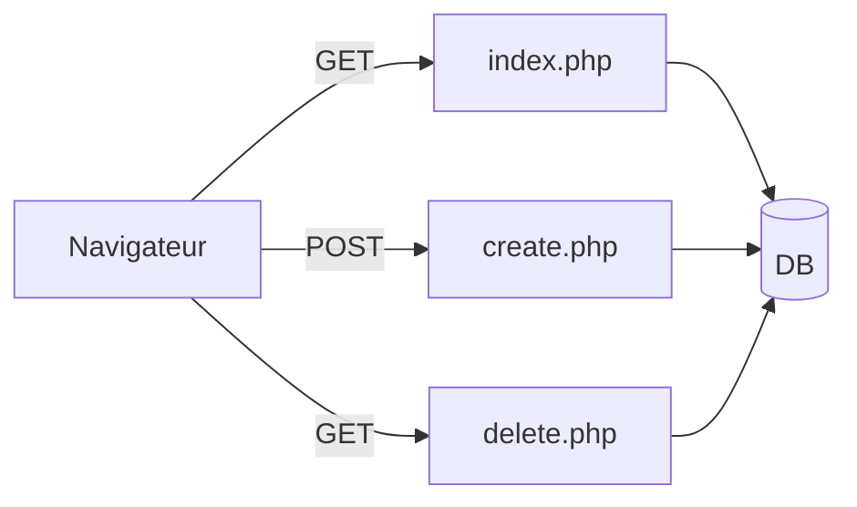
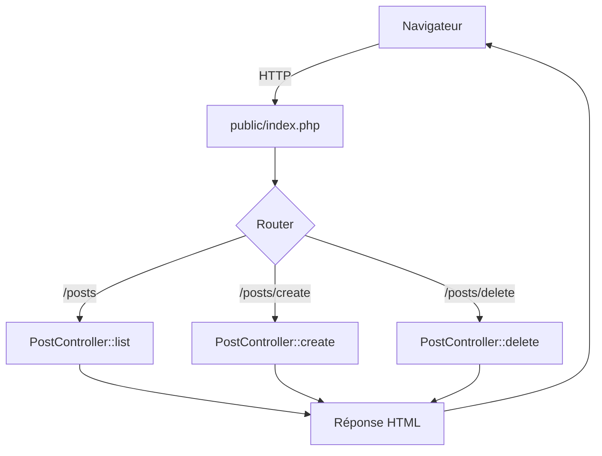
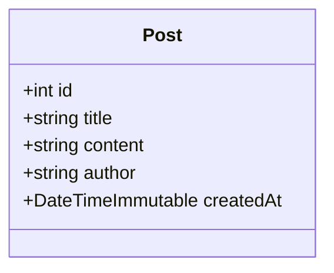
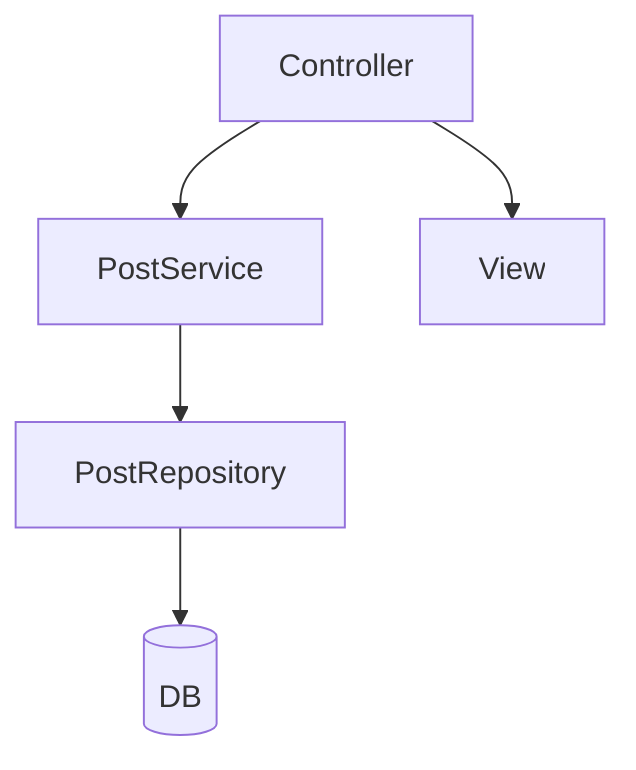
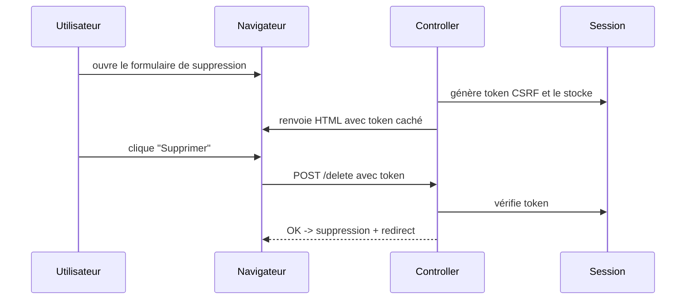

# Cours MVC en PHP - Du procédural au MVC POO (mini blog)

Ce cours vise à rendre **MVC concret** tout en donnant une base **théorique solide** pour comprendre ensuite Symfony sans le “subir”.

Avant toute chose, à l'instar de la POO, MVC ne doit pas être appliqué de manière dogmatique. C’est une manière de **réduire le chaos** en séparant clairement les responsabilités, afin que le code reste modifiable sans casse.

---

## Prérequis techniques

On part sur PHP 8.1+ (idéalement 8.2 ou 8.3) avec un serveur local (Apache, Nginx ou `symfony serve`) et une base MariaDB/MySQL (ou SQLite si besoin). Le code de départ est un mini blog simple (liste, création, suppression) avec PDO, ce qui est parfait : le périmètre fonctionnel est petit, donc on peut se concentrer sur l’architecture.

---

## L’idée générale : pourquoi on “évolue” du procédural vers MVC

Au début, le procédural marche. C’est même souvent la meilleure option pour apprendre : on voit tout, tout de suite, sans magie. Mais dès qu’un projet grandit un peu, le même fichier finit par contenir à la fois :

- de la lecture de paramètres HTTP (`$_GET`, `$_POST`)
- des décisions sur “quoi faire”
- de la validation de formulaire
- des requêtes SQL
- et du HTML mélangé au PHP

Le problème n’est pas “le procédural”, ni “PDO”, ni “PHP qui est nul”. Le vrai problème, c’est l’absence de **frontières** : quand tout est partout, personne ne sait plus où toucher sans provoquer des effets de bord.

### Schéma du problème typique (monopage qui grossit)



Ce schéma n’est pas “mal” moralement. Il illustre juste que tout dépend de tout, et donc que la maintenance devient difficile.

---

## MVC : définition claire, utile, et surtout testable

MVC signifie Model - View - Controller.

* Le **Controller** reçoit la requête HTTP, décide quoi faire, orchestre les appels, puis choisit une réponse.
* Le **Model** représente les données et la logique liée à ces données (accès DB, entités, règles métiers, services).
* La **View** s’occupe du rendu (souvent HTML), et ne doit pas contenir de SQL ni de logique métier.

Ce qui est intéressant pédagogiquement, c’est que MVC force à répondre à une question simple :
“Quand je veux modifier l’affichage, où est-ce que je vais ? Quand je veux modifier une règle, où est-ce que je vais ? Quand je veux modifier une requête, où est-ce que je vais ?”

### Schéma MVC minimal (web)



À ce stade, tu peux poser une règle d’or facile à retenir :

> Le contrôleur orchestre, le modèle sait, la vue montre.

---

## Vue d’ensemble de la progression (liée aux branches `mvcevo`)

Dans le repo GitHub `mvcevo`, les “paliers” (branches) font très bien le boulot : chaque étape enlève un type de mélange, et introduit une responsabilité claire.

L’objectif n’est pas de produire “l’architecture parfaite”. L’objectif est de comprendre la différence entre :

* “ça marche” (procédural rapide)
* et “ça se maintient” (structure claire)

On peut raconter cette progression comme une histoire : au départ on code vite, puis on commence à souffrir, alors on découpe, puis on centralise l’entrée, puis on sépare le rendu, puis on centralise le SQL, puis on transforme les actions en contrôleurs POO, puis on sort la logique métier dans des services.

---

## Étape A - La version procédurale monopage (volontairement imparfaite)

Au départ, on prend une seule page `index.php`. Elle liste les articles, et selon un paramètre `action`, elle peut aussi créer ou supprimer. Sur le moment, c’est rassurant : tout est là, on comprend facilement l’exécution.

Mais très vite, on voit la limite : les sections “create” et “delete” sont des “mini-programmes” cachés dans le même fichier. Quand on ajoute une fonctionnalité (par exemple “modifier un article”), on ajoute encore une section, et le fichier devient une forêt.

### Schéma typique d’un contrôleur procédural “action-based”



Ce schéma est parfait pour expliquer le problème : un seul fichier cumule les rôles. L’étape suivante consiste souvent à “séparer par pages”.

---

## Étape B - Procédural multi-fichiers (page = action)

On sépare `index.php` (liste), `create.php`, `delete.php`, et on garde `db.php` pour la connexion. Ce n’est pas encore MVC, mais on sent déjà un gain : chaque fichier a un objectif plus clair.

Le piège pédagogique ici, c’est que ça marche tellement bien qu’on peut s’y installer. Pourtant, dès qu’on a plusieurs ressources (posts, users, comments), on duplique des morceaux identiques (connexion DB, header HTML, gestion d’erreurs, etc.). On a aussi une architecture qui devient “une page par action”, ce qui ne ressemble pas aux frameworks modernes.

### Schéma “page = action”



Cette étape est utile parce qu’elle rend visible le prochain besoin : unifier l’entrée et éviter la duplication.

---

## Étape C - Front Controller : une seule porte d’entrée

C’est un concept extrêmement important pour comprendre Symfony ensuite.

Un **Front Controller** signifie : “toutes les requêtes web passent par un seul fichier”, souvent `public/index.php`. Ce fichier devient la porte d’entrée unique. Il peut ensuite faire du routage, appliquer des règles communes (sessions, sécurité minimale, gestion des erreurs), puis déléguer à un contrôleur.

Ce concept règle d’un coup plusieurs problèmes : on centralise la configuration, on évite que des scripts internes soient accessibles directement, et on se rapproche de la logique des frameworks.

### Arborescence recommandée

```text
mini-blog-mvc/
  public/
    index.php
  src/
  templates/
  config/
  vendor/
```

Ici, `public/` est la seule racine web. Le reste n’est pas accessible directement par HTTP, ce qui est déjà une forme de “sécurité passive”.

### Schéma du Front Controller + Router



À ce stade, on n’est pas obligé d’être en POO. Le simple fait d’avoir une seule entrée et un routage centralisé est déjà un énorme progrès.

---

## Étape D - Les vues : templates + layout

Une fois que les actions sont centralisées, on s’attaque au rendu. Le problème classique est que le contrôleur “echo” du HTML, ou mélange du HTML dans sa logique. L’idée est d’extraire l’affichage dans des fichiers de templates.

Le contrôleur prépare des données (par exemple `$posts`), puis appelle un rendu (`render`) qui inclut un layout commun et une vue spécifique.

### Schéma “Controller -> View (avec données)”

```mermaid
flowchart LR
  C[Controller] -->|params| R[render(template, params)]
  R --> L[layout.php]
  L --> T[template: post/list.php]
  T --> H[HTML final]
```

À partir de là, nous povons introduire une règle simple :

> La vue a le droit d’utiliser des variables, mais elle n’a pas le droit d’aller chercher des données (pas de SQL, pas de PDO, pas de logique métier).

On peut aussi poser l’idée de “contrat de données” : le contrôleur garantit que la vue reçoit les variables dont elle a besoin.

---

## Étape E - Le Model : Repository + Entité (ou DTO simple)

Le gros gain de MVC, côté “model”, c’est d’éviter le SQL dispersé. On centralise l’accès aux données dans une classe, souvent appelée `Repository`. Ce repository devient “l’endroit unique” où l’on écrit les requêtes liées à une ressource (ici : les posts).

Nous pouvons expliquer ça comme une séparation de deux connaissances :

* le contrôleur connaît les actions web (list, create, delete)
* le repository connaît comment parler à la base (SELECT, INSERT, DELETE)

### Diagramme Repository (accès DB)

```mermaid
classDiagram
  class PostRepository {
    -PDO pdo
    +findAll(): array
    +create(title, content, author): void
    +delete(id): void
  }
  PostRepository --> PDO : utilise
  PDO --> "Database" : connecte
```

Ensuite, nous pouvons introduire une idée très utile sans trop alourdir : une “entité” `Post`. Même si on reste simple, ça permet d’éviter les tableaux associatifs partout et de donner une structure stable aux données.

### Exemple : entité Post (simple)



Le message théorique important : une entité n’est pas juste “un sac de propriétés”, c’est une représentation d’un concept métier. Même dans un mini blog, “Post” est un concept.

---

## Étape F - Controllers en POO : actions = méthodes

Le passage en POO pour les contrôleurs est un cap pédagogique important. Il permet de comprendre l’injection de dépendances (même sans container), et de structurer l’application en objets qui ont chacun un rôle.

Le contrôleur devient une classe `PostController` avec des méthodes `list`, `create`, `delete`. Il reçoit un `PostRepository` (ou plus tard un `PostService`).

### Diagramme Controller -> Repository -> DB

```mermaid
flowchart LR
  C[PostController] --> R[PostRepository]
  R --> DB[(Database)]
  C --> V[render(view)]
  V --> U[Navigateur]
```

Nous pouvons insister sur un point qui prépare Symfony : le contrôleur n’instancie pas tout lui-même “n’importe comment”. Il reçoit ses dépendances, ce qui rend le code plus testable et plus propre.

---

## Étape G - Service : la logique métier sort du contrôleur

Même avec un repository, on peut encore se retrouver avec un contrôleur trop gros si on met dedans toutes les validations et règles.

Le **service** sert à porter les règles métiers et les validations cohérentes. L’idée est de rendre le contrôleur “bête mais lisible” : il lit la requête, appelle le service, puis choisit une vue ou une redirection.

### Schéma “Controller fin -> Service -> Repository”



Nous pouvons aussi en profiter pour expliquer le vocabulaire important :

* Repository : “accès aux données”
* Service : “règles et orchestration métier”
* Controller : “orchestration HTTP”

Ce trio est une base qui colle très bien à Symfony.

---

## Sécurité minimale : ce qu’on fait “bien” même dans un mini projet

L’objectif n’est pas de transformer le mini blog en appli blindée, mais on peut introduire quelques réflexes.

D’abord, la sortie HTML : on échappe ce qui vient de l’utilisateur. Sinon, un article peut contenir du JavaScript malveillant (XSS). Même en TP, c’est un bon moment pour apprendre `htmlspecialchars()`.

Ensuite, la suppression : pédagogiquement, un lien GET est simple. Mais théoriquement, supprimer via GET est dangereux. En “vrai”, on passe par POST et on protège par un token CSRF.

### Schéma CSRF (idée)



Ce schéma suffit souvent à faire comprendre “pourquoi Symfony insiste”.

---

## Pont vers Symfony : ce que Symfony ajoute vraiment

Une fois que l'on comprend cette progression, Symfony devient beaucoup moins intimidant. Symfony ne change pas l’idée, il industrialise la mise en œuvre.

Dans Symfony :

* le front controller existe déjà (`public/index.php`)
* le routage est robuste et déclaratif (attributs, YAML, etc.)
* les contrôleurs sont des classes
* le rendu utilise Twig (plus propre que du PHP brut dans les templates)
* l’injection de dépendances est gérée par un container
* la sécurité, les erreurs, la configuration sont standardisées

### Mapping mental MVC -> Symfony

```mermaid
flowchart LR
  A[Ton mini MVC] --> B[Symfony]
  A1[public/index.php] --> B1[Front Controller Symfony]
  A2[Router maison] --> B2[Routing Symfony]
  A3[render() maison] --> B3[Twig + render()]
  A4[Repository PDO] --> B4[Doctrine Repository ou PDO Service]
  A5[Services] --> B5[Services + DI Container]
```

L’idée forte : “Symfony est ton architecture MVC, mais en version standard, robuste et outillée”.

---

## Exercices progressifs (compatibles avec ton découpage par paliers)

Une fois le socle compris, tu peux proposer des ajouts qui renforcent le modèle mental, sans exploser la charge :

1. Ajouter une route “voir un article” (show) pour introduire la notion de ressource adressable.
2. Ajouter “edit” pour introduire le cycle lecture -> formulaire -> validation -> update.
3. Passer delete en POST + CSRF pour l’hygiène sécurité.
4. Ajouter Composer autoload + namespaces pour professionnaliser l’arborescence.
5. Ajouter une gestion d’erreur propre (404, 500) centralisée via le front controller.

---

## Conclusion

Le but de ce cours n’est pas de faire du “MVC académique”. Le but est de comprendre pourquoi les frameworks structurent les projets de cette manière.

Le cours permet de structurer ces idées :

* une requête web passe par une entrée unique
* le contrôleur orchestre
* le modèle gère les données et les règles
* la vue rend sans savoir “comment” les données ont été obtenues

alors Symfony devient une suite logique, pas une montagne.

